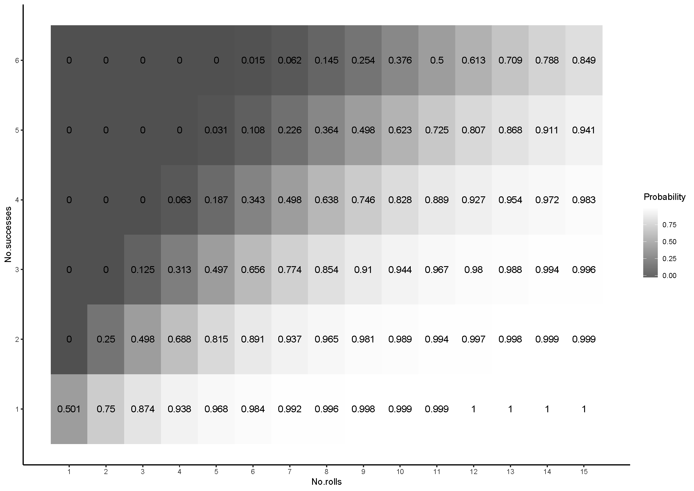

\

### 2019-08-18 - MidWest PopGen Conference

I attended the MidWest PopGen conference in Chicago and it was a lot of fun, with lots of interesting talks by a lot of people. I didn't realise Chicago was so human genetics focused, which was interesting. I presented my work on host-parasite co-evolution of the DNA virus and *Drosophila* and ended up winning a prize for best presentation, which was swell. Unfortunately didn't get to see any of Chicago as the meeting was so short, but there will hopefully be another time.

### 2019-07-25 - Evolve and resequence

The machine-learning tool Rob and I designed appears to be good at CNV cool particularly in pools it seems. Due to this, I've started looking into CNVs in pooled experimental evolution. The idea is that CNVs changing in frequency may be the cause of some of the SNPs that are significantly changing between timepoints in evolve and resequence experiments. Will start looking in *Drosophila simulans* EE and if convincing I'll expand into *Drosophila melanogaster*.

-----

### 2019-07-07 - Collections in Ithaca

For this past week I've been in Ithaca collecting *Drosophila* for the K99 I've submitted, as well as to escape the heat of Kansas, as Ithaca was maxed out at 25C, while Kansas has been around 30C. It was really fun to catch up with Ana and Ivan, really beautiful and kind of strange compared to Kansas, specifically I couldn't get over how hilly everywhere was and how close together everything is, I guess I've become a Kansan local. Either way, I ended up collecting close to 1000 flies (mostly dead, some alive), so was a successful trip.

However, my trip back has not been so successful. Just before my first flight back, a thunderstorm came over Ithaca, delaying us by 3 hours, after that mechanical errors held us back another hour, resulting in me missing my flight from DC to KC. After being moved to the next flight the next morning, it turned out that flight was cancelled and moved to *the next* day, which was then canceled completely like 20 minutes later. United couldn't get me a set of flights back in the next 2 days so I ended up switching to a different airline in a different airport, which let me see some of the sights around DC. I'm currently waiting in Atlanta and hopefully getting back late tonight and hopefully get to sleep on the planes.

-----

### 2019-06-13 - K99 submission, Brandon Sanderson and dog sickness

Even though I finished my K99 last week, it wasn't actually submitted until yesterday. It was suprisingly stressful, as it turns out a lot of the formatting and required documents aren't really mentioned online, which resulted in lots of last minute changes, rushed paragraphs and poorly written letters. I was happy with the submission, though less so after the last minute cutting down. Here's hoping though!

I also finished the Mistborn series by Brandon Sanderson and have to say, those are fantastic books. The magic system he's created is comprehensive and interesting, based on gaining powers based on different types of consumed metals. I attempted to start reading his other big series, The StormLight Archives and have not been able to get inot these however. This feels much more of a standard fantasy series, with the magic not as well fleshed out. I'll power through, but if I had to recommend just one, Mistborn all the way.

While Dana is away I'm taking care of her dog. I'm not sure if it's stress or illness, but she's frustratingly not been eating her food consistently. Some days she'll eat normally, some days she'll only eatout of my hand, some days she'll only eat wet food. I'm taking her to the vets tomorrow and hopefully they'll be able to clarify some things.

-----

### 2019-06-09 - K99 and Blackstone Fortress

I've submitted my K99 application finally and am free of this thing until it gets to review time.

Last night we played [BlackStone Fortress](https://www.games-workshop.com/en-US/Warhammer-Quest-Blackstone-Fortress-2018-eng) again, and it's a lot of fun, but far too complicated for what it is. Additionally, the characters are insanely unbalancing, with a few who get inspired (sort of leveling up) by finding an item and then become really powerful for every session for the rest of forever. Comparatively, some of the characters (namely the tank and healer) have fewer moves per turn, have less movement and need to get inspired again every session by killing a certain type of enemy. And if you don't face that enemy ever then you're screwed. In our sessions this has left us with 2 or 3 characters who began overpowered and have since accumulated so many items that they're broken compared to the everyone else. 

The game also uses variants of D6/D8/D12 with modified symbols for skills. Some skills come up more than others, so if your defense is a D12 compared to your agility, you'll have a much better time than others. 
Overall the game is fun though, looking forward to finishing it in the next week or so. Supposedly the fantasy version has simpler rules and is more streamlined, plus fantasy is more fun thank grim-dark so looking forward to testing out this other version.

-----

### 2019-06-03 - Professor Layton and my attempt at machine-learning

While Dana is away, I'm also going to finally work through a couple of the Professor Layton games, puzzle games I've been wanting to play for close to ten years. Turns out I'm not very good at puzzle games. Even so, I managed to finish it last night and the story was some how both predictable and crazy.

Meanwhile, Rob and I have put together a tool to detect copy variants in NGS data using machine-learning. Machine-learning is really cool, and super useful, basically letting the computer decide what can define a category is really powerful. Of course if you're not using the right input information, you could end up inferring the completely wrong thing, so I'm still kind of iffy about it, but looking forward to using the tool to detect CNVs in AMPs. My initial survey looks like there's a relationship between the variation in AMP copy number, and the average copy number. Worth expanding on this.

Finally, it turns out the real hero who died for our sins to save humanity is Mothra, with her sick new design and awesome song.

-----

### 2019-05-25 - Thoughts on Lady Blackbird and Blogdown

Having now played [Lady Blackbird](http://www.onesevendesign.com/ladyblackbird/lady_blackbird.pdf) with my game group, I still can't quite wrap my head around its interesting skill/dice mechanic. A character in the game has 4 traits that describe something about the character (e.g. they're a detective, they're cunning, they're a country girl), and each trait then has a set of tags of characteristics related to that trait (e.g. a detective might be perceptive, have a gun, have authority). When the player meets a challenge, they say how they want to approach the challenge and the game master sets a challenge level (1-6), as the number of 4-6's that need to be rolled to to succeed. The more needed, the higher the difficulty. 
Following this, the player choose a trait that is relevant to the challenge (e.g. a cunning character could talk their way out of a fight), and any tags under that trait which could help. The number of tags is the number of dice you get to roll. After this, the players have a finite pool of dice that they can add to try and get enough to roll and succeed. 
So there's a strange negotiation that happens with every dice roll that you don't see in other games which kind of grinds the game to a halt. On top of that, the maths behind success rates become more counter intuitive as the number of 4-6's needed increases.

Ended up spending far more time that I should have working out the best strategies for dice rolls in the game.

I'd definitely play it again, as, despite it's simplicity, we probably spent more time discussing the weirdness of the games mechanics much more than with any other game.
I've also been playing around with swapping out this simple webpage with a much more advanced version in Blogdown, but for the life of me I've not been able to get it to work for anything. Maybe future Tom will have more luck, but for now I'm stuck with this thing. I've also heard Jekyll is worth it for a github page, but I'm enjoying doing everything in R at the moment and would rather not switch. Hopefully Boryana will be able to show me the right path to go down on Wednesday when she makes everything seem much simpler.

-----

### 2019-05-24 - Building a website

Testing out how to make a webpage in markdown using R. It's been suprisingly simple, though I've not experimented beyond a basic layout. May change it up and combine everything onto one page, as I don't have much to show at the moment. Hopefully Boryana will be able to show me how to spice it up.

Next week, my fiance is leaving for Argentina for 6 weeks. Because of this, I was foolish enough to buy a new video game that I'm already absorbed into. Apparently I've only played bad Legend of Zelda games, as none of them have grabbed me before, but 'A Link Between Worlds' is phenomenal. As with most  Zelda games, it's an action RPG with lots of puzzles, but the game introduces a great new mechanic which literally adds another dimension to all of gameplay. Once you gain the ability to merge into walls (becoming 2D), you end up looking at every facet of the game (combat, puzzles, races, exploration) and wondering how it could be approached a different way, how could being 2D allow me to more effectively solve this problem. The transitions between 2D and 3D are also extremely fluid, not stopping the game cold like in Paper Mario. I'm already 1/4 of the way through after 2 days and will definitely be ordering another 3DS Zelda game to try out once I've finished.

-----
