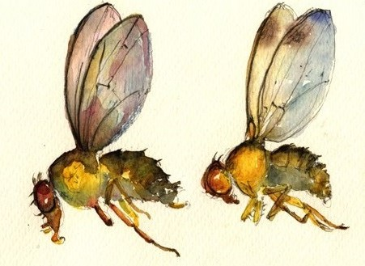

---
---

\

I am a postdoctoral researcher at the [University of Kansas](https://ku.edu/) in the [Unckless lab](http://www.uncklesslab.com/), in the [Department of Molecular Biosciences](https://molecularbiosciences.ku.edu/). I like to analyze data and test hypotheses concerning host-parasite co-evolution in *Drosophila*. I also like to play board/video games, think about game mechanics, the statistics of games and bioinformatics.

I graduated from the [University of Reading](http://www.reading.ac.uk/) in the United Kingdom with a BSc in Biological Sciences in 2012, and then from the [Vienna Graduate School of Population Genetics](https://www.popgen-vienna.at/) with a PhD in Population Genomics in 2016. For my PhD in the [Betancourt Lab](https://www.flyevolution.net/), I studied the horizontal transfer and fitness costs of transposable elements in *Drosophila*. Since 2016 I have worked at the University of Kansas, studying co-evolution of *Drosophila innubila* and their associated DNA virus, DiNV. I also study the evolution of antimicrobial peptides and other immune effector molecules.

My full CV is available [here](files/TH_CV_201905.pdf).

-----

### News

**2019-05-27: New preprint - Transposable element dynamics are consistent across the Drosophila phylogeny, despite drastically differing content.**
[Available on BiorXiv](https://www.biorxiv.org/content/10.1101/651059v1), will be submitted for publication as soon as the data is published.  