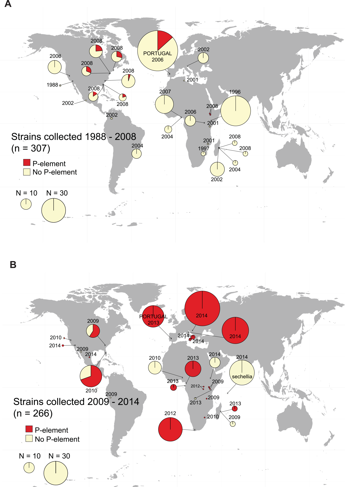

---
---

\

# Host-parasite co-evolution of *Drosophila innubila* and its parasites

Though *Drosophila melanogaster* is a staple system for studying evolution, little is known about its ecology. Additionally, Sophophora (the group containing *D. melanogaster*) represents only ~300 of the *Drosophila* species, compared to the ~1400 *Drosophila* in the sister clade. Mycophagous *Drosophila* have been extensively studied ecologically for ~40 years, are highly diverged from *D. melanogaster*, and are preliminary models for the evolution of toxin-tolerance, immunity, host-parasite evolution and behavior. I study *D. innubila*, a species of mycophageous *Drosophila* of particular interest due to its high frequency infection by a DNA virus and a male-killing *Wolbachia*. I'm particularly interested in identifying novel methods of parasite regulation, outside those characterized in *D. melanogaster*. I also examine the evolution of Drosophila innubila Nudivirus (DiNV), the parasite infecting *D. innubila*, I find signatures of selection in a few key genes in both DiNV and related viruses.

* [Unckless (2011), A DNA virus of *Drosophila*.](files/RU_PlosOne_2011.pdf)
* [Hill and Unckless (2017) Baculovirus Molecular Evolution via Gene Turnover and Recurrent Positive Selection of Key Genes.](files/TH_JV_2017.pdf)
* [Hill and Unckless (2018) The dynamic evolution of Drosophila innubila Nudivirus.](files/TH_IGE_2018.pdf)
* [Hill, Koseva and Unckless (2019) The genome of *Drosophila innubila* reveals lineage-specific patterns of selection in immune
genes.](files/TH_MBE_2019.pdf)

 

# Horizontal spread of transposable elements in *Drosophila*

Previously the transposable element 'P-element' horizontally invaded *D. melanogaster*, causing the hybrid dysgenesis phenotype, a phenotype where females lacked fully developed or functional ovaries. I identified the spread of P-element to *D. simulans* and characterized hybrid dysgenesis in this species. More recently I have been using sequencing information of the P-elements in *D. melanogaster* and *simulans*, combined with world fruit trade data to characterize the phylogeography of the spread of P-element worldwide. I have also been interested in the rates of horizontal transfer of TEs between species of overlapping ranges, using the sympatric *D. pseudoobscura* group as a study system. I find rampant horizontal exchange between the species, suggesting that hybrid dysgenesis may not be as catestrophic a phenotype in the wild as in the lab.

* [Kofler et al (2015) The recent invasion of natural *Drosophila simulans* populations by the P-element.](files/TH_PNAS_2015.pdf)
* [Hill, Schlotterer & Betancourt (2016) Hybrid dysgenesis in *Drosophila simulans* associated with a rapid invasion of the P-element.](files/TH_PlosG_2016.pdf)
* [Hill & Betancourt (2018) Extensive horizontal exchange of transposable elements in the *Drosophila pseudoobscura* group.](files/TH_MobileDNA_2018.pdf)
* [Hill (2019) Transposable element dynamics are consistent across the *Drosophila* phylogeny, despite drastically differing content.](files/TH_biorxivTE_2019.pdf)
* Hill et al (in prep) The phylogeography of dysgenesis-causing transposable elements in *Drosophila melanogaster* and *simulans.*
* Hill et al (in prep) The evolution of the piRNA pathway across the *Drosophila* phylogeny.

 

# Balancing selection in the *Drosophila* immune system mediated by rampant gene duplication

While it appears that a majority of immune genes in *Drosophila melanogaster* are evolving under positive selection, a few genes, such as AMPs, and immune genes in other species, appear to be under balancing selection, likely due to a trade off between the benefit of a resistance allele under infection and its cost when not infected. I'm interested in the population genetics of these genes and the causes of the signatures of balancing selection, specifically if these are driven by duplication events. I am currently using machine learning to identify if AMPs duplicate more than background genes across the *Drosophila* phylogeny.

* [Balancing selection drives maintenance of
genetic variation in *Drosophila*
antimicrobial peptides.](files/TH_GBE_2019.pdf)
* Hill & Unckless (In prep) A simple deep-learning approach for detecting duplications and deletions in next-generation sequencing data.
* Hill & Unckless (In prep) Rampant duplication drives antimicrobial peptide diversity across the *Drosophila* phylogeny.

